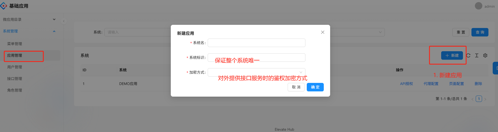
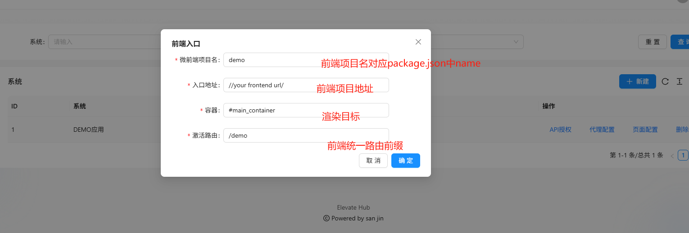
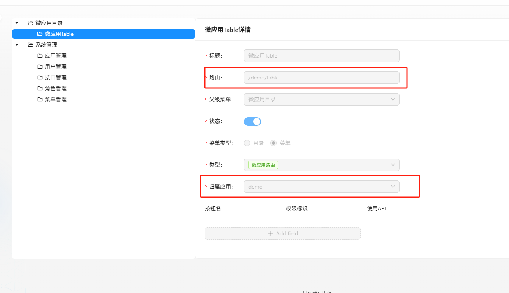
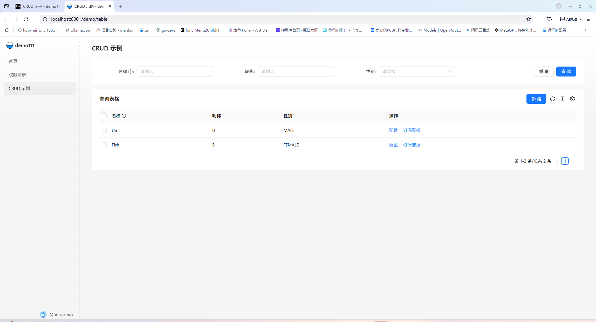
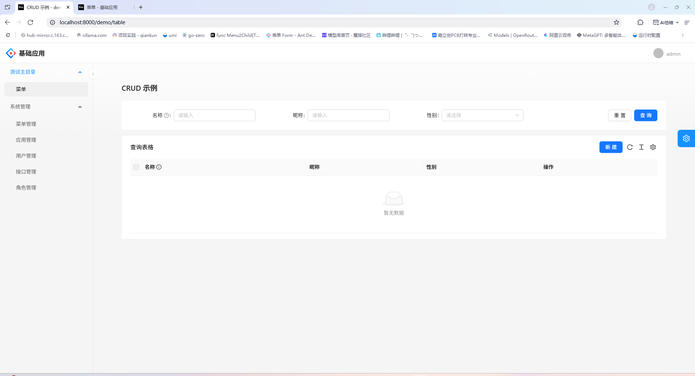

# 介绍
一个基于GIN和qiankun 为解决多前端而开发的微应用管理系统
### 持续开发ing

## go version 1.23

## 运行命令
go run main.go

## 打包命令
go build -o basic-system-api

## Docker 
docker build -t basic-system-api:v1 -f  Dockerfile .

## 使用说明

## 业务配置

### 应用配置
#### 1. 新增应用

#### 2. 页面接入配置

### 菜单配置

### 微应用

### 主应用访问

## 前端地址

https://github.com/wangxin529/basic-system-frontend
